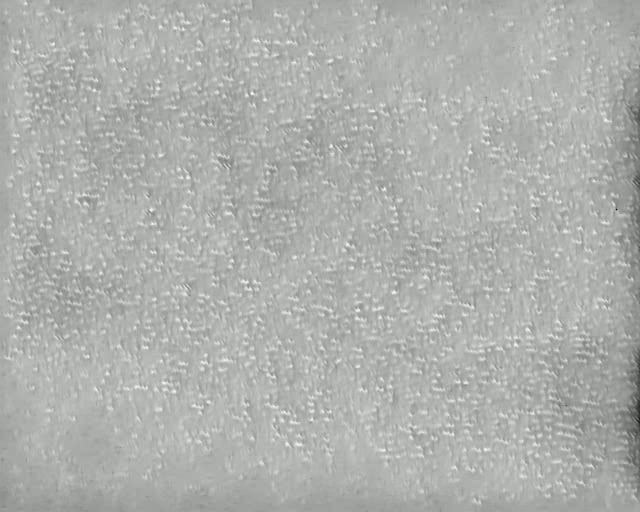
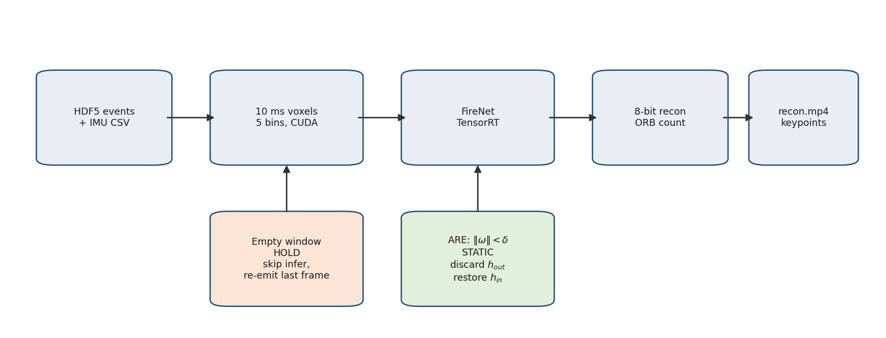
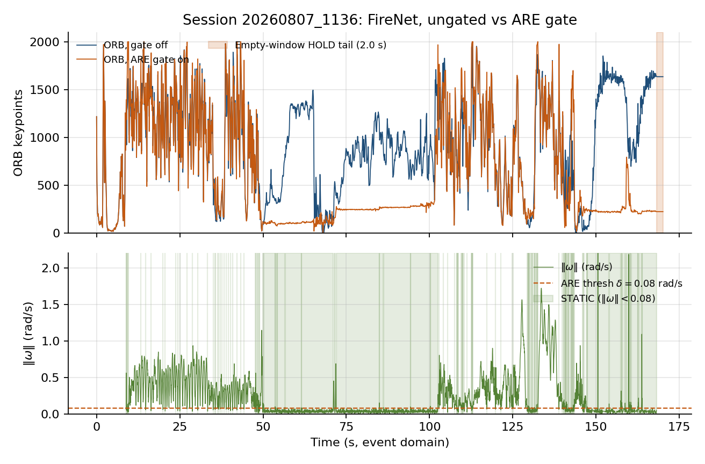
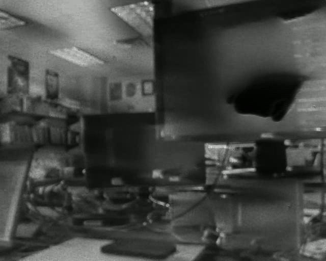
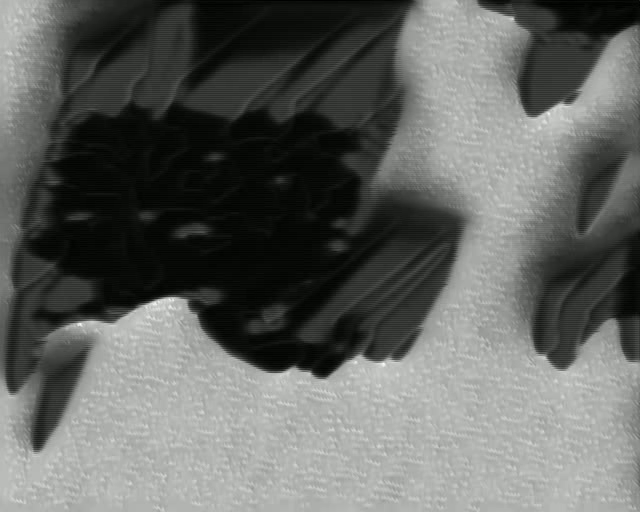
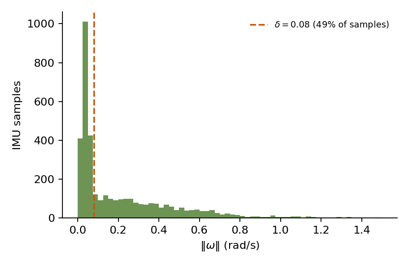

# Zero-Velocity Detection for Holding Event-to-Video Reconstructions on a Pure EVS Camera

**Vyapak Bansal**  
Intelligent Navigation and Mapping Laboratory, Schulich School of Engineering  
University of Calgary, Calgary, AB, Canada  
vyapakbansal@gmail.com

---

## Abstract

A pure event vision sensor (EVS) such as the Lucid Triton2 has no concurrent grayscale output, so there is no fallback image when the scene stops changing. Recurrent event-to-video (E2V) networks like FireNet store scene appearance in a hidden state that is overwritten by every new window of events. When the camera is still, the event rate drops, the network is fed near-empty voxels, and the reconstruction fades in about one to two seconds. Feature tracking, a live preview, or a detector then loses its input. This paper treats that failure as a zero-velocity detection (ZVD) problem, the same still/moving test used in inertial navigation. Skog, Handel, Nilsson, and Rantakokko showed that an angular-rate energy (ARE) detector using only the gyroscope beats accelerometer-only tests, and that their fused detector (SHOE) is only a small gain over ARE. From that work we take a MEMS gyroscope as enough to decide that a sensor is stationary. We do not use it to recover how the sensor is moving. FireNet's hidden state is then gated like an INS update: shut when still, open when moving.

We implement two holds in a CUDA/TensorRT pipeline (libeventgate). Empty-window HOLD re-emits the last reconstruction when a 10 ms window has zero events. An ARE-style gate declares STATIC when \(\|\boldsymbol{\omega}\| < \delta\) and discards FireNet's hidden-state write-back, so leftover events (noise, hot pixels, faint texture) cannot keep updating a still camera. On a 168 s indoor Lucid Triton2 recording (Sony IMX637, \(640\times 512\), \(1.107\times 10^9\) events) with a software-aligned MEMS IMU, both holds are run on the same bag. Empty-window HOLD reuses one FireNet frame for 2.00 s after the last event (ORB stuck at 1634 with the gate off). The ARE gate at \(\delta = 0.08\) rad/s (`--gate --gyro-thresh 0.08`) leaves MOVING windows almost unchanged (mean ORB 980 ungated vs. 977 gated) and drops STATIC windows (mean ORB 914 vs. 292; median 238). A shared gate for a stereo EVS pair is specified so both cameras use one decision. Gyro-only ZVD cannot see translation with no rotation. That is a limit of this detector on a camera mount, not a disagreement with Skog's gait results.

**Index terms:** Event camera, event-to-video reconstruction, FireNet, zero-velocity detection, MEMS IMU, angular-rate energy, ConvGRU, stereo event cameras.

---

## I. Introduction

A conventional camera integrates light over an exposure and outputs a dense frame at a fixed rate, even if nothing in the scene moves. An event camera reports only changes: each pixel fires when log-intensity crosses a threshold, producing tuples \((x,y,t,p)\) at microsecond resolution [1]. High dynamic range, low latency, and little motion blur are why these sensors show up in robotics and driving research [1]-[3]. A static scene produces almost no data. Units such as the Lucid Triton2 (Sony IMX637) used here are pure EVS devices [14]. Unlike DAVIS, they do not also output a grayscale frame [1]. If a later stage needs an intensity image, that image has to be reconstructed from events alone.

E2VID [4] and the much smaller FireNet [5] both take a voxel grid of recent events and output an image, carrying a hidden state \(h_t\) across time. FireNet needs that recurrence: its receptive field is too small to build a scene from one window [5]. At a stop, relative motion goes to zero, pixels mostly stop firing, empty or noisy voxels still go into the net, \(h_t\) is overwritten, and the image fades to gray grain in about 1-2 s [5]. ORB or FAST, a live preview, or a detector then sees a faded reconstruction instead of a usable image.

A frame camera does not fail this way. Aimed at a still scene it keeps producing an image, because capture does not require motion. Pure EVS needs an external cue that the sensor is still, so the last reconstruction can be kept. That cue is a yes/no stationarity test. Inertial navigation has studied the same test for years as zero-velocity detection.

Skog *et al.* [6] put the usual detectors (acceleration moving variance, acceleration magnitude, and angular-rate energy) in one likelihood-ratio framework and derived a fused test (SHOE). On foot-mounted gait, ARE beat both accelerometer tests, and SHOE was only slightly better than ARE [6], [7]. A later review reports the same ranking [8]. We use that ranking for a still/moving test only. A MEMS gyroscope is enough to detect that a sensor is stationary. It is not enough to recover linear velocity.

ZVD was originally used to correct an INS: when the foot is planted, velocity is known to be zero and that measurement updates a Kalman error state [12]. We are not running an INS. FireNet's ConvGRU is also updated from a noisy stream and also degrades when that stream goes quiet. The question we need answered is the same one Skog asked: is the platform still, from inertial data, without a full motion model. If it is, his ranking of which detector to use still applies.

This paper (i) treats reconstruction blackout on a pure EVS as ZVD rather than as a request for a larger network or a full odometry stack, (ii) implements empty-window HOLD and an ARE-style IMU gate that drops FireNet's hidden-state update when \(\|\boldsymbol{\omega}\| < \delta\), and (iii) measures both holds on a 168 s Triton2 session (\(\delta = 0.08\) rad/s from the same IMU trace) and specifies a shared-gate API so a stereo EVS pair can use one still/moving decision.

The paper is organized as follows. Section II covers E2V, event-inertial odometry, and ZVD. Section III states the problem. Section IV describes both holds. Section V is the implementation. Sections VI and VII are the experiment and results. Section VIII discusses limits and follow-on work.

---

## II. Related Work

### A. Event-to-Video Reconstruction

Rebecq *et al.* [4] reconstruct HDR video from events with a recurrent U-Net (E2VID). Scheerlinck *et al.* [5] introduce FireNet, about 38k parameters, several times faster than E2VID at a modest quality cost. FireNet's recurrent links are required; removing them ruins reconstruction. E2VID is more tolerant because of a larger receptive field [5]. Neither paper studies what happens to \(h_t\) when the camera stops. Their test sequences are moving. Contrast maximization and motion compensation [1] fix smear during motion. Decay at rest is a different failure, and it only shows up if something downstream needs the reconstruction to last through a stop.

### B. Event-Inertial Odometry and SLAM

EVO [9], ESVO [2], Ultimate SLAM [10], and ESVIO [11] use an IMU as a motion prior inside a tracker or filter for pose. Those systems estimate how the camera moved. We only test whether it moved, and we use that bit to gate a reconstruction buffer rather than a trajectory. We do not run SLAM and we report no ATE.

### C. Zero-Velocity Detection

Foxlin [12] used zero-velocity updates (ZUPTs) on a shoe-mounted INS: during stance, velocity is zero and that fact corrects filter error. Skog, Handel, Nilsson, and Rantakokko [6] asked how to detect stance. They showed that moving-variance, magnitude, and ARE tests are likelihood-ratio tests under different priors, and they derived SHOE from all three. On level-ground walking at about 3-5 km/h, ARE beat both accelerometer tests, and SHOE added little [6]. The IPIN companion paper reports the same order: gyro is the most useful zero-velocity cue for that gait, and ARE and SHOE both reached 0.14% of distance in the INS [7]. Wahlstrom and Skog [8] keep that ranking and note that a fixed threshold gets worse when gait speed changes. Our fixed \(\delta\) has the same issue (Section VIII-D). Nilsson *et al.* [13] show that ZUPTs do not make yaw or the gravity-aligned gyro bias observable. That is a different quantity than the one we use ZVD for.

Two points matter when moving this to a camera. First, Skog's IMU is on a shoe that is planted each step. Ground contact forces zero velocity, not just a quiet gyro. A camera IMU can have \(\boldsymbol{\omega} \approx 0\) while the platform still translates, so ARE can miss translation on a camera mount (Section VIII). Second, ZUPTs correct a filter state over time. We only need a yes/no on whether to accept a network state update.

### D. Position of This Work

ZVD papers are about INS correction. E2V papers are about motion sequences. Recurrent reconstructors still lose their hidden state on empty input, and an inertial still/moving bit can stop that update. We did not find a paper that applies Skog-style ARE to FireNet state in this way.

---

## III. Problem Formulation

Let \(\mathcal{E} = \{(x_i, y_i, t_i, p_i)\}\) be events from a pure EVS of size \(W \times H\). Time is split into windows \([t_k, t_k+\Delta t)\) with \(\Delta t = 10\) ms. Events in window \(k\) form a voxel tensor \(V_k \in \mathbb{R}^{B \times H \times W}\) with \(B = 5\) bins. FireNet is

\[
(\hat{I}_k,\, h_k) = f(V_k,\, h_{k-1}),
\]

where \(\hat{I}_k\) is the reconstructed image and \(h_k\) is the ConvGRU state. During motion, \(V_k\) has signal and \(h_k\) tracks the scene. At rest, \(V_k \approx 0\) except for noise and hot pixels. If \(f\) still runs, \(h_k\) is overwritten and \(\hat{I}_k\) decays [5].

The layout matches ZUPT with different objects: an INS error state drifts unless stance interrupts the update; here a ConvGRU is overwritten unless a still detector interrupts it. Let \(D_k \in \{0,1\}\) with \(D_k = 1\) meaning still. Then the hidden-state update is refused: \(h_k = h_{k-1}\). Empty-window HOLD also sets \(\hat{I}_k = \hat{I}_{k-1}\) by skipping inference. The ARE gate still runs \(f\) so leftover events cannot write \(h_k\), so \(\hat{I}_k\) can still change with \(V_k\) while \(h\) is frozen (Section IV-B). When \(D_k = 0\), FireNet updates as usual.

\(D_k\) comes from two places (Section IV): an empty event window, \(|\{i : t_i \in [t_k, t_k+\Delta t)\}| = 0\), and an ARE-style test on \(\boldsymbol{\omega}_k\) from a MEMS IMU (\(\mathbf{a}\), \(\boldsymbol{\omega}\)) mapped into the event clock (Section VI). The IMU is only a still/moving classifier. It is not used as a velocity sensor.

---

## IV. Method

Fig. 1 is the pipeline. The two holds answer the same question (commit this window's state or not) from different evidence. They are used together.

### A. Empty-Window HOLD

If window \(k\) has no events and a previous reconstruction exists, voxelization and FireNet are skipped and the last host frame is written again to video and to the keypoint counter. HOLD needs no IMU and fires only when a window is empty, including a 2 s tail after the last event in our run. It misses the case where hot pixels or faint contrast still fill \(V_k\) and would decay \(h_t\) even though the camera is not really moving. The IMU gate in Section IV-B covers that case.

### B. Angular-Rate Energy Gate

Skog's ARE detector calls the IMU still when gyro energy in a short window is below a threshold [6]. With a slow sidecar IMU we use the Euclidean norm of the sample nearest the window start:

\begin{equation}
\|\boldsymbol{\omega}\| = \sqrt{\omega_x^2 + \omega_y^2 + \omega_z^2},
\qquad
D_k^{\mathrm{IMU}} = \mathbf{1}\bigl[\|\boldsymbol{\omega}_k\| < \delta\bigr].
\label{eq:are}
\end{equation}

This is a one-sample ARE test. A windowed energy statistic or SHOE [6] can replace \(\|\boldsymbol{\omega}\|\) in \eqref{eq:are} if the IMU is sampled fast enough (Section VIII).

When \(D_k^{\mathrm{IMU}} = 1\) (STATIC), FireNet still runs. The output state \(h_{\mathrm{out}}\) is thrown away and \(h_{\mathrm{in}}\) is restored from a device copy of the last committed state, instead of skipping inference as HOLD does. The gate is meant to protect \(h\) from leftover events that an emptiness check would miss. The image \(\hat{I}_k\) is still \(f(V_k, h_{\mathrm{held}})\), so ORB can drop during STATIC if \(V_k\) is sparse. The hold is on \(h\). Pixels stay identical only when HOLD also fires. When \(D_k^{\mathrm{IMU}} = 0\) (MOVING), \(h_{\mathrm{out}}\) is copied to \(h_{\mathrm{in}}\) and the hold buffer is updated. The TensorRT export must expose \(h_{\mathrm{in}}\) and \(h_{\mathrm{out}}\) as named tensors; otherwise the freeze has no effect.

We do not use accelerometer-only tests as the main gate. That follows [6], [7]. It is also a poor cue on a rigid camera: a still mount still sees \(\|\mathbf{a}\| \approx g\).

**False STATIC.** If the camera translates with \(\|\boldsymbol{\omega}\| < \delta\) (slider, straight-line vehicle motion, a pan with almost no rotation), \eqref{eq:are} will freeze a reconstruction that should keep updating. That is expected ARE behavior when the IMU is not on a planted foot [6], [8]. Section VIII treats it as a limit of the claim.

### C. Fade-horizon latch

The window where \(\|\boldsymbol{\omega}\|\) first drops below \(\delta\) is already event-starved: FireNet has been fed a few hundred milliseconds of dying voxels, so freezing *that* canvas looks gray. Scheerlinck *et al.* [5] and the ungated run here both show reconstructions fading in about 1-2 s of weak input. The released pipeline [15] keeps a 1 s buffer of inferred frames and, at STATIC *onset*, snapshots the most recent frame whose event count is at least half the peak in the buffer. The latch is applied only if STATIC then lasts at least 1 s (`--hold-min-static-s 1`). On this bag the median gyro-quiet bout is about 80 ms (IMU chatter at 24 Hz); those bouts never freeze. A 5 s minimum would wait past the 1-2 s fade, so the held canvas would already be dead.

A shorter lookback (0.2-0.3 s) still sits in the deceleration tail. A longer one (2 s) can freeze a canvas from a different heading. Section VII does not re-measure this latch; those tables are freeze-\(h\) (`session_1136_gated`) and last-window skip-infer (`session_1136_hold`).

### D. Shared Gate for Stereo EVS

If two EVS cameras reconstruct on their own, they will not freeze at the same time. After a stop the pair holds two different last scenes, which is bad for disparity and for stereo odometry later [2]. The rule is one \(D_k\) per timestamp, applied to both reconstructions. The code takes two HDF5 streams and one IMU file and runs the cameras one after the other with the same \(\delta\), so a 6 GB GPU does not need two engines at once. This session recorded one camera, so stereo is in the API and is not measured.

---

## V. Implementation

Table I lists the stack. Events are HDF5 arrays \((x, y, t_{\mu\mathrm{s}}, p)\). Each 10 ms window is packed on the host and accumulated on the GPU. FireNet runs in TensorRT with a 512 MB workspace cap. Output floats are min-max scaled to 8-bit for ORB and for an MPEG-4 preview. ORB is a count of features (cap 2000), not a tracker. We do not claim tracking quality, only how the count behaves under HOLD and STATIC. Source and build files are in [15].

**Table I.** Hardware and software.

| Item | Specification |
|------|----------------|
| Event camera | Lucid Triton2 EVS, Sony IMX637, \(640\times 512\), EVT 3.0, 2.5 GigE |
| IMU | MEMS; CSV columns `timestamp_us`, `gyro_xyz`, `accel_xyz` |
| Compute | Intel Core 7 240H, RTX 4050 Laptop (6 GB), Windows / WSL2 |
| Reconstruction | FireNet [5], TensorRT FP16, about 7 ms/window |
| Voxel grid | 5 bins, 10 ms, polarity accumulate |
| Keypoints | OpenCV ORB, cap 2000 |
| Library | libeventgate (`eventgate`) [15] |

`--gate --gyro-thresh δ` turns on \eqref{eq:are}. Without it, IMU samples are still logged, but FireNet always commits \(h_{\mathrm{out}}\) except during empty-window HOLD.

---

## VI. Experimental Setup

**Sequence.** Session `20260807_1136`, one Triton2 recording (`event_cam_0`): \(N = 1\,107\,493\,508\) events, 168.15 s on the event clock, \(t \in [4.593, 168152.190]\) ms. The IMU has 3819 samples over 159.24 s at about 24.0 Hz after alignment.

**Time alignment.** Event times are device microseconds from EVT 3.0. IMU device time was mapped into that domain by co-stopping at the end of the bag and applying a linear wall-clock map. This is software sync, not PTP or a hardware trigger. Overlap is 159.24 s. The IMU starts 8.91 s after the first event, so the opening seconds have no inertial data.

**Reconstruction runs.** FireNet was run twice on the same HDF5 file, same engine, same 10 ms windows (17,014 total, including a 2.00 s empty tail): (i) IMU gate off (`out/session_1136`); (ii) IMU gate on, \(\delta = 0.08\) rad/s (`--gate --gyro-thresh 0.08`, `out/session_1136_gated`). Peak device memory was 1328 of 6140 MiB. Mid-run inference was about 7 ms per window, faster than real time on this laptop.

**Threshold.** On the aligned IMU, \(\|\boldsymbol{\omega}\|\) has min 0.0002, median 0.087, 95th percentile 0.77, max 4.37 rad/s. We set \(\delta = 0.08\) rad/s near the median. At that value, 49% of IMU samples are STATIC and the longest quiet stretch is about 13 s (\(t \approx 72\) to \(85\) s). After alignment, 16,122 of 17,014 windows have an IMU sample; 8332 are STATIC and 7790 are MOVING under \eqref{eq:are}.

---

## VII. Results

### A. Empty-Window HOLD

On the ungated run, Fig. 2 (blue) is ORB count over 17,014 windows: min 2, max 2000, mean 914. The last change is at \(t = 168.14\) s, the last event. The next 200 windows (2.00 s) all have count **1634**. The HOLD start and end stills below differ by at most 20 gray levels after MPEG-4, which matches reuse of one canvas rather than 200 separate inferences.

| HOLD start \(t=168.14\) s | HOLD end \(t=170.13\) s |
|---|---|
|  |  |

### B. Qualitative Reconstructions

Fig. 3 is three ungated FireNet frames. At \(t = 40\) s (motion) the lab (monitors, shelves, ceiling lights) is readable despite smear and grain. At \(t = 80\) s, in a low-\(\|\boldsymbol{\omega}\|\) interval, the image is still FireNet-soft because of the network, not because of rest. At \(t = 169\) s, in the HOLD tail, the frame is the last window FireNet actually produced: noisy and low contrast, not a clean still of the room. HOLD keeps whatever FireNet last output. The high ORB count on that frame is partly min-max stretch of noise into 8-bit texture that ORB treats as corners. 1634 identical counts means the count is frozen, not that there are 1634 good landmarks.

### C. ARE Gate Versus Ungated (Same Bag)

Fig. 2 overlays gated ORB (orange) on ungated ORB (blue). STATIC intervals from \eqref{eq:are} are shaded on the gyro plot. Table II splits counts by STATIC / MOVING using the nearest IMU sample (coverage from \(t \approx 8.91\) s).

**Table II.** ORB counts, ungated vs. ARE gate (\(\delta = 0.08\) rad/s).

| Split | Windows | Ungated mean / median | Gated mean / median |
|-------|---------|------------------------|---------------------|
| STATIC (\(\|\boldsymbol{\omega}\| < \delta\)) | 8332 | 914 / 885 | **292 / 238** |
| MOVING | 7790 | 980 / 1026 | 977 / 1009 |
| All windows | 17,014 | 914 / - | 608 / - |
| HOLD tail (2.00 s) | 200 | 1634 (identical) | 223 (identical) |

Two observations:

1. **Motion is almost unchanged.** MOVING means differ by about 3 (980 vs. 977). The ARE test is not randomly suppressing FireNet whenever the scene is busy.
2. **Rest is where the gate acts.** STATIC mean ORB falls from 914 to 292. The HOLD tail is still 200 identical samples, but the held count is 223 gated vs. 1634 ungated, because freezing \(h\) while still running on sparse voxels (Section IV-B) yields a duller last canvas than skipping inference.

`--gate` is a gyro test that refuses to commit \(h_{\mathrm{out}}\) in STATIC and barely changes MOVING. It does not freeze the last sharp lab photo. Empty-window HOLD is still what keeps pixels identical when \(n=0\).

Fig. 4 is the \(\|\boldsymbol{\omega}\|\) histogram and the same \(\delta\).

**Table III.** Session summary.

| Quantity | Value |
|----------|--------|
| Events | \(1.107\times 10^9\) |
| Event duration | 168.15 s |
| Reconstruction windows | 17,014 \(\times\) 10 ms (incl. 2.00 s tail) |
| FireNet time (mid-run) | about 7 ms/window |
| Peak VRAM | 1328 / 6140 MiB |
| IMU rate (aligned) | 24.0 Hz, 3819 samples |
| IMU-event start gap | 8.91 s |
| \(\delta\) | 0.08 rad/s (49% of IMU samples below) |
| IMU gate | Off (`session_1136`) and on (`session_1136_gated`) |

---

## VIII. Discussion

### A. What "sufficient" means

Skog *et al.* [6] asked whether cheap inertial data can detect foot stance well enough for ZUPTs. For ARE and SHOE, on the gaits they tested, gyro energy did most of the work [6], [7]. The same detector can decide whether FireNet's hidden state should stop updating. A MEMS IMU is enough for that still/moving test. No absolute velocity sensor is required. Section VII-A shows HOLD on true silence. Section VII-C shows that the same \(\delta\) changes ORB in STATIC and not in MOVING.

A MEMS IMU is not enough to recover the camera's linear velocity. This paper does not claim that. Integration drifts in seconds [8], and a gyro cannot see translation with no rotation. Skog's shoe hits the ground each step. A Triton2 on a slider, a drone, or a vehicle does not, which is why Section IV-B lists false STATIC. A fixed \(\delta\) also has to be retuned if the IMU or the motion mix changes [8]. The value 0.08 rad/s used here sits near this bag's median \(\|\boldsymbol{\omega}\|\) and is not a universal threshold.

### B. Two holds

Empty-window HOLD is measured in Section VII-A. The IMU gate is an ablation on the same bag (Section VII-C). It does not freeze the last good photo pixel-for-pixel. HOLD covers the case where events actually stop. The ARE gate covers rotationally quiet windows that still contain leftover events, by discarding \(h_{\mathrm{out}}\). Gated ORB plateaus near 200-300 are a flatter, weaker reconstruction with frozen \(h\) and sparse \(V_k\), not 1634 good landmarks held from the ungated tail.

### C. Stereo and reconstruction quality

Stereo needs one shared \(D_k\) if disparity is to stay consistent after a stop. We recorded one camera, so that is not measured. The flags `--events-left`, `--events-right`, and one IMU are already in the CLI. FireNet on dense 10 ms windows (often \(10^4\) to \(10^5\) events) is soft, as in [5], and min-max stretch per window makes it worse (Section VII-B). Improving reconstruction quality is separate from deciding when to hold a state.

### D. Next steps

1. **Gyro-blind translation and a fixed \(\delta\).** False STATIC in Section IV-B is a known ARE limit on a free mount. Accelerometer *magnitude* is a weak fix on a rigid camera (Section IV-B). SHOE [6] adds acceleration *variance* to ARE, which can react to jitter during otherwise quiet translation. SHOE wants a faster IMU than the 24 Hz sidecar used here, because energy and variance need enough samples per window. A fixed \(\delta\) also degrades when the motion mix changes [8]. Both of those are logging and threshold choices, not a new reconstructor.

2. **Stereo gate.** A synced Triton2 pair, the same \(D_k\) on both reconstructions, and a check that disparity on the held pair stays stable, would connect this work to ESVO [2] and ESVIO [11] without building those systems here.

---

## IX. Conclusion

A pure EVS camera has no grayscale image when the world stops changing. Recurrent E2V nets forget the scene unless something holds their state. On a 168 s, \(1.11\times 10^9\)-event Triton2 recording we measured two holds: empty-window HOLD reuses the last FireNet frame for 2.00 s after the last event, and an ARE-style MEMS gyro gate at \(\delta = 0.08\) rad/s, following Skog *et al.* [6], changes ORB counts in STATIC windows and leaves MOVING windows almost unchanged. The IMU is enough for that detection job. It is not a stand-in for visual odometry. A shared gate for stereo EVS is specified so both cameras use the same still/moving decision.

---

## Acknowledgments

This work was carried out in the Intelligent Navigation and Mapping Laboratory (INML), Schulich School of Engineering, University of Calgary, under the supervision of Dr. Hongzhou Yang.

---

## Software availability

The CUDA/TensorRT pipeline (HDF5 events, IMU ARE gate, empty-window HOLD, fade-horizon latch, stereo CLI) is released as libeventgate [15]. FireNet weights are not redistributed; they are obtained from the authors of [5]. The session used here is about 6 GB of events and is not in the repository.

---

## References

[1] G. Gallego *et al.*, "Event-based vision: A survey," *IEEE Trans. Pattern Anal. Mach. Intell.*, vol. 44, no. 1, pp. 154-180, Jan. 2022.

[2] Y. Zhou, G. Gallego, and S. Shen, "Event-based stereo visual odometry," *IEEE Robot. Autom. Lett.*, vol. 6, no. 2, pp. 621-628, Apr. 2021.

[3] D. Gehrig, M. Gehrig, J. Hidalgo-Carrio, and D. Scaramuzza, "Video to events: Recycling video datasets for event cameras," in *Proc. IEEE/CVF Conf. Comput. Vis. Pattern Recognit. (CVPR)*, 2020.

[4] H. Rebecq, R. Ranftl, V. Koltun, and D. Scaramuzza, "High speed and high dynamic range video with an event camera," *IEEE Trans. Pattern Anal. Mach. Intell.*, vol. 43, no. 6, pp. 1964-1980, Jun. 2021.

[5] C. Scheerlinck, H. Rebecq, D. Gehrig, N. Barnes, R. Mahony, and D. Scaramuzza, "Fast image reconstruction with an event camera," in *Proc. IEEE Winter Conf. Appl. Comput. Vis. (WACV)*, 2020, pp. 156-163.

[6] I. Skog, P. Handel, J.-O. Nilsson, and J. Rantakokko, "Zero-velocity detection: An algorithm evaluation," *IEEE Trans. Biomed. Eng.*, vol. 57, no. 11, pp. 2657-2666, Nov. 2010. [Online]. Available: https://ieeexplore.ieee.org/document/5523938/

[7] I. Skog, J.-O. Nilsson, and P. Handel, "Evaluation of zero-velocity detectors for foot-mounted inertial navigation systems," in *Proc. Int. Conf. Indoor Positioning Indoor Navigat. (IPIN)*, 2010.

[8] J. Wahlstrom and I. Skog, "Fifteen years of progress at zero velocity: A review," *IEEE Sensors J.*, vol. 21, no. 2, pp. 1139-1151, Jan. 2021.

[9] H. Rebecq, T. Horstschafer, G. Gallego, and D. Scaramuzza, "EVO: A geometric approach to event-based 6-DOF parallel tracking and mapping in real time," *IEEE Robot. Autom. Lett.*, vol. 2, no. 2, pp. 593-600, Apr. 2017.

[10] A. R. Vidal, H. Rebecq, T. Horstschaefer, and D. Scaramuzza, "Ultimate SLAM? Combining events, images, and IMU for robust visual SLAM in HDR and high-speed scenarios," *IEEE Robot. Autom. Lett.*, vol. 3, no. 2, pp. 994-1001, Apr. 2018.

[11] P. Chen, W. Guan, and P. Lu, "ESVIO: Event-based stereo visual-inertial odometry," *Sensors*, vol. 23, no. 4, 2023.

[12] E. Foxlin, "Pedestrian tracking with shoe-mounted inertial sensors," *IEEE Comput. Graph. Appl.*, vol. 25, no. 6, pp. 38-46, Nov./Dec. 2005.

[13] J.-O. Nilsson, I. Skog, and P. Handel, "A note on the limitations of ZUPTs and the implications on sensor error modeling," in *Proc. Int. Conf. Indoor Positioning Indoor Navigat. (IPIN)*, 2012.

[14] Lucid Vision Labs, "Triton2 EVS (TRT003S-EC)," product documentation. [Online]. Available: https://thinklucid.com/product/triton2-evs-0-3mp-imx637/

[15] V. Bansal, "libeventgate," GitHub repository, 2026. [Online]. Available: https://github.com/VyapakBansal/libeventgate

---

## Figure captions

**Fig. 1.** Pipeline. Events are voxelized and passed to FireNet. Empty windows re-emit the last reconstruction (HOLD). An ARE-style IMU test may discard a ConvGRU write-back (STATIC).



**Fig. 2.** Session `20260807_1136`. Top: ORB count with the IMU gate off (blue) and with `--gate --gyro-thresh 0.08` (orange). The band at the end is the 2.00 s empty-window HOLD tail. Bottom: \(\|\boldsymbol{\omega}\|\) and STATIC intervals at \(\delta = 0.08\) rad/s.



**Fig. 3.** FireNet stills, \(640\times 512\), ungated video. (a) \(t=40\) s, motion. (b) \(t=80\) s, low gyro. (c) \(t=169\) s, HOLD tail (last reconstructed frame, reused).

| (a) \(t=40\) s | (b) \(t=80\) s | (c) \(t=169\) s HOLD |
|---|---|---|
|  |  |  |

**Fig. 4.** Histogram of \(\|\boldsymbol{\omega}\|\) on the aligned IMU and the ARE threshold \(\delta = 0.08\) rad/s.



---

## Appendix: Reproducibility commands

Figures (ungated vs gated overlay):

```bash
python3 scripts/plot_imu_hold_paper.py \
  --imu eventgate_usb/imu.csv \
  --keypoints out/session_1136/keypoints.csv \
  --keypoints-gated out/session_1136_gated/keypoints.csv \
  --out figures/imu_gated_evs_hold \
  --thresh 0.08
```

Ungated reconstruction (Section VII-A, VII-B):

```bash
./build/eventgate --events eventgate_usb/events.h5 \
  --imu eventgate_usb/imu.csv --engine engines/firenet.engine \
  --out out/session_1136 --blackout-tail-s 2 --vram-every 50
```

Freeze-\(h\) ablation (Section VII-C, Table II; `out/session_1136_gated`):

```bash
export LD_LIBRARY_PATH="${HOME}/sdks/TensorRT-10.16.1.11/lib:${LD_LIBRARY_PATH:-}"
./build/eventgate --events eventgate_usb/events.h5 \
  --imu eventgate_usb/imu.csv --engine engines/firenet.engine \
  --gate --gyro-thresh 0.08 --out out/session_1136_gated \
  --blackout-tail-s 2 --vram-every 50
```

Fade-horizon latch (library default [15]; not Table II):

```bash
./build/eventgate --events eventgate_usb/events.h5 \
  --imu eventgate_usb/imu.csv --engine engines/firenet.engine \
  --gate --gyro-thresh 0.08 --hold-lookback-s 1 --hold-min-static-s 1 --hold-release-s 0.25 \
  --out out/session_1136_lookback --blackout-tail-s 2 --vram-every 50
```
