# Zero-Velocity Detection for Holding Event-to-Video Reconstructions on a Pure EVS Camera

**Overleaf source:** upload the `paper/` folder (`main.tex`, `refs.bib`, `figures/`). Compiler: pdfLaTeX.

**Vyapak Bansal**  
Intelligent Navigation and Mapping Laboratory, Schulich School of Engineering  
University of Calgary, Calgary, AB, Canada  
vyapakbansal@gmail.com

---

## Abstract

A pure event vision sensor (EVS), such as the Lucid Triton2, has no concurrent grayscale output, so there is no fallback image when a scene stops changing. Recurrent event-to-video (E2V) networks like FireNet hold scene appearance in a hidden state that every new window of events overwrites. When the camera stops, the event rate collapses, the network is fed near-empty voxels anyway, and the reconstruction fades within one to two seconds, taking any downstream feature tracker or preview down with it. We treat this as a zero-velocity detection (ZVD) problem, the still/moving test long used in inertial navigation, rather than as a reconstruction-quality problem. Skog, Handel, Nilsson, and Rantakokko showed that an angular-rate energy (ARE) detector using only the gyroscope beats accelerometer-only tests, and that their fused detector (SHOE) improves on ARE only marginally. We take from that result a narrow claim: a MEMS gyroscope is sufficient to decide that a sensor is stationary, not how it is moving. FireNet's ConvGRU state is then gated the way an INS error state is gated under ZUPT: shut when still, open when moving.

We implement two holds in a CUDA/TensorRT pipeline (libeventgate). Empty-window HOLD re-emits the last reconstruction when a 10 ms window has zero events. An ARE-style gate declares STATIC when \(\|\boldsymbol{\omega}\| < \delta\) and, in the released pipeline, latches a recent high-quality frame rather than continuing to run FireNet on residual noise. On a 168 s indoor Triton2 recording (Sony IMX637, \(640\times 512\), \(1.107\times 10^{9}\) events) with a software-aligned MEMS IMU, both mechanisms are measured on the same bag. Empty-window HOLD reuses one FireNet frame for 2.00 s after the last event, with the ORB count frozen at 1634. A freeze-hidden-state ablation of the ARE gate at \(\delta = 0.08\) rad/s leaves MOVING windows essentially unchanged (mean ORB 977 gated vs. 980 ungated) while STATIC windows drop sharply (mean ORB 292 vs. 914, median 238 vs. 885): the gate is selectively suppressing the exact windows it should, without disturbing motion. That ablation still runs FireNet on sparse voxels while discarding its state update, so the emitted image itself continues to fade; the released default instead skips inference after 1 s of confirmed STATIC and re-emits a recent high-event-count frame from a rolling buffer. That latch is measured on the same bag in Section VII-D: MOVING stays close to ungated, and long STATIC bouts lock to identical canvases rather than continuing to fade. A shared-gate specification lets a stereo EVS pair use one still/moving decision instead of two independent ones. Gyro-only ZVD cannot see translation that produces no rotation; we treat this as a known limit of the detector on an unconstrained mount, not a challenge to Skog's original gait results, and outline the direct extension (SHOE, a higher-rate IMU) that addresses it.

**Index terms:** Event camera, event-to-video reconstruction, FireNet, zero-velocity detection, MEMS IMU, angular-rate energy, ConvGRU, stereo event cameras.

---

## I. Introduction

A conventional camera integrates light over a fixed exposure and outputs a dense frame at a fixed rate whether or not the scene moves. An event camera reports only change: each pixel fires independently when its log-intensity crosses a threshold, producing tuples \((x,y,t,p)\) at microsecond resolution [1]. High dynamic range, low latency, and negligible motion blur are why these sensors have found traction in robotics and driving [1]-[3]. The same asynchronous design means a static scene produces almost no data at all. The Lucid Triton2 (Sony IMX637) used in this work is a pure EVS device [14]: unlike a DAVIS sensor, it does not additionally output a synchronized grayscale frame [1]. Any stage downstream that needs an intensity image has to reconstruct one from events alone, with nothing to fall back on.

E2VID [4] and the much smaller FireNet [5] both map a voxel grid of recent events to an image while carrying a hidden state \(h_t\) across time, and FireNet in particular depends on that recurrence: its receptive field is too small to build a scene from a single window in isolation [5]. This is exactly what breaks at a stop. Relative motion goes to zero, pixels stop firing except for noise and hot pixels, the near-empty voxel is fed to the network anyway, \(h_t\) is overwritten, and the reconstruction fades to gray grain within roughly one to two seconds [5]. ORB or FAST tracking, a live preview, or a detector then loses input that was never actually gone, only forgotten by the network responsible for holding it.

A frame camera has no such failure mode: pointed at a still scene, it keeps producing the same picture, because capture never depended on motion in the first place. What pure EVS needs is an external signal that the sensor is not moving, so the last valid reconstruction can be held instead of allowed to decay. Framed this way, the problem is not new. It is the same binary decision inertial navigation has studied for two decades as zero-velocity detection.

Skog *et al.* [6] placed the classical ZVD detectors (acceleration moving variance, acceleration magnitude, and angular-rate energy) inside one generalized likelihood-ratio framework and derived a fused detector, SHOE, from all three priors. On foot-mounted gait data, ARE alone outperformed both accelerometer tests, and SHOE improved on ARE only marginally [6], [7]. A later fifteen-year review confirms the same ranking [8]. The claim we take from this is specific: a MEMS gyroscope is sufficient to detect that a sensor is stationary. It is not sufficient to recover how the sensor is moving, and we do not use it that way anywhere in this paper.

What is new here is not the gate itself but the mapping. ZUPT was built to correct an inertial navigation filter: when a foot is planted, velocity is known to be zero, and that fact corrects a Kalman error state [12]. We run no such filter. What we have instead is a ConvGRU hidden state playing a structurally identical role: it is continuously updated by a noisy input stream, and it degrades exactly when that stream stops carrying signal. The contribution of this paper is recognizing that the decision problem Skog solved, namely whether a platform is still using only inertial evidence and no full motion model, is precisely the decision problem reconstruction blackout needs solved, and that his evidence about which detector to use transfers with it. The mechanism, once the mapping is granted, is a few lines of TensorRT state management. The mapping is the part worth defending carefully.

This paper makes three contributions.

1. **Reframing.** Reconstruction blackout on a pure EVS is stated as zero-velocity detection, with the correspondence made explicit: FireNet's ConvGRU state plays the role of the INS error state Skog's detectors were built to protect, and his finding that gyroscope evidence dominates accelerometer evidence for this specific decision transfers with it.
2. **Mechanism.** Two holds implementing that reframing: empty-window HOLD, which needs no IMU and fires only on true event silence, and an ARE-style IMU gate that, in its released form, latches a recent high-quality frame once STATIC is confirmed for at least 1 s, rather than letting the canvas continue to fade on residual events.
3. **System and evidence.** Both mechanisms implemented in libeventgate [15] (CUDA voxelization, TensorRT FireNet with exposed hidden-state tensors, ORB-based keypoint counting), a shared-gate specification for stereo EVS pairs, and a 168 s Triton2 session on which empty-window HOLD is measured directly, a freeze-hidden-state ablation of the ARE gate is measured against a STATIC/MOVING split of the same recording, and the released fade-horizon latch is shown on that same bag (Section VII-D).

Section II situates this against E2V reconstruction, event-inertial odometry, and ZVD. Section III formalizes the correspondence. Section IV describes both holds, including the fade-horizon latch that distinguishes the released default from the ablation reported in Section VII. Section V summarizes the implementation. Sections VI-VII report the experiment. Section VIII states the boundary of the claim and the extensions it implies.

---

## II. Related Work

### A. Event-to-Video Reconstruction

Rebecq *et al.* [4] showed that a recurrent U-Net (E2VID) reconstructs HDR video from events alone. Scheerlinck *et al.* [5] introduced FireNet, roughly 38k parameters, several times faster than E2VID at a modest quality cost. Both papers show FireNet's recurrent connections are load-bearing: removing them destroys reconstruction outright, while E2VID degrades more gracefully because of its larger receptive field [5]. Neither paper studies what happens to \(h_t\) when the camera stops, because neither benchmark includes a stop; their test sequences are all in motion. Contrast-maximization and motion-compensation methods [1] address the opposite regime, correcting smear during motion. Decay at rest is a separate failure that is invisible unless a downstream process specifically needs the reconstruction to survive a stop.

### B. Event-Inertial Odometry and SLAM

EVO [9], ESVO [2], Ultimate SLAM [10], and ESVIO [11] all fuse an IMU into a tracker or filter to estimate camera pose. That is architecturally the opposite of what we do here: those systems use the IMU to say how the camera moved; we use it only to say whether it moved at all, and only to gate a reconstruction buffer, never a trajectory. We do not run SLAM or odometry and report no ATE, because the claim does not need one.

### C. Zero-Velocity Detection

Foxlin [12] introduced ZUPT for shoe-mounted inertial navigation: during stance, velocity is known to be zero, correcting filter error. Skog *et al.* [6] asked the prior question, how to detect stance, showing that moving-variance, magnitude, and ARE tests are all likelihood-ratio tests under different priors, and deriving SHOE from all three. On level-ground gait at roughly 3-5 km/h, ARE alone beat both accelerometer tests, and SHOE's gain over ARE was marginal [6]. A companion IPIN study reports the same ordering directly: gyroscope carries the most reliable zero-velocity information for that gait, with both ARE and SHOE reaching 0.14% of distance traveled in the resulting INS [7]. Wahlstrom and Skog's review [8] confirms the ranking holds across later work and flags that fixed thresholds degrade as gait speed changes, a caution our fixed \(\delta\) inherits directly (Section VIII-D). Nilsson *et al.* [13] separately show that ZUPTs do not make yaw or the gravity-aligned gyro bias observable, a limitation about a different quantity than the one this paper uses ZVD for.

Two distinctions matter when moving this evidence to a camera. First, Skog's IMU sits on a shoe mechanically forced into ground contact each step, so zero velocity is enforced by contact, not only inferred from a quiet gyro. A camera IMU has no such constraint: it can read \(\|\boldsymbol{\omega}\| \approx 0\) while the platform still translates freely, a blind spot ARE cannot see on this kind of mount (Section VIII-A). Second, and more favorably, ZUPTs correct a filter's internal state continuously and cumulatively, while this paper needs only a binary decision on whether to accept a single network update, a substantially weaker requirement. The first distinction is why gyroscope-only detection has a known limit on a camera; the second is why, despite that limit, it remains sufficient for the specific decision needed here.

### D. Position of This Work

ZVD literature is built around correcting inertial navigation filters. E2V literature is built around motion sequences. Between them sits a case neither addresses: a recurrent reconstruction network's hidden state, which decays under near-empty input exactly the way an INS accumulates unconstrained drift, and which can be protected the same way, with an external, inertially derived stationarity signal. We are not aware of prior work stating this correspondence explicitly or measuring it against a real reconstruction pipeline.

---

## III. Problem Formulation

Let \(\mathcal{E} = \{(x_i, y_i, t_i, p_i)\}\) be an event stream from a pure EVS of resolution \(W \times H\). Time is partitioned into windows \([t_k, t_k+\Delta t)\), \(\Delta t = 10\) ms. Events in window \(k\) are voxelized into \(V_k \in \mathbb{R}^{B \times H \times W}\), \(B = 5\). FireNet computes

\[
(\hat{I}_k,\, h_k) = f(V_k,\, h_{k-1}),
\]

where \(\hat{I}_k\) is the reconstructed image and \(h_k\) the ConvGRU state. During motion, \(V_k\) carries signal and \(h_k\) tracks the scene as intended. At rest, \(V_k \approx 0\) except for noise and hot pixels; if \(f\) still runs unconditionally, \(h_k\) is overwritten by that near-empty input and \(\hat{I}_k\) decays [5].

This has the same structure as ZUPT with the objects substituted: an INS error state drifts under unconstrained inertial integration unless stance interrupts the update; here, a ConvGRU state decays under near-empty event input unless a stationarity detector interrupts it. Let \(D_k \in \{0,1\}\), with \(D_k = 1\) meaning still. The released update is

\begin{equation}
(\hat{I}_k, h_k)=
\begin{cases}
(\hat{I}_{k-1},\, h_{k-1}) & n_k = 0,\\[4pt]
(\hat{I}_{\ell(k)},\, h_{k-1}) & D_k = 1,\\[4pt]
f(V_k, h_{k-1}) & D_k = 0,
\end{cases}
\end{equation}

where \(n_k\) is the event count in window \(k\) and \(\ell(k)\) is the fade-horizon index in Section IV-C. Confirmed STATIC skips \(f\) entirely. The freeze-\(h\) ablation in Section VII-C is a different map: \(\hat{I}_k = f(V_k, h_{\mathrm{held}})\), \(h_k = h_{\mathrm{held}}\). That is why Table II STATIC canvases still fade. When \(D_k = 0\), FireNet updates normally.

\(D_k\) is sourced from two signals, corresponding to Section IV: emptiness of the window itself, \(|\{i : t_i \in [t_k, t_k+\Delta t)\}| = 0\), and an ARE-style test on angular rate \(\boldsymbol{\omega}_k\) from a MEMS IMU providing specific force \(\mathbf{a}\) and angular rate \(\boldsymbol{\omega}\), mapped into the event clock (Section VI). Consistent with Section I, the IMU functions only as a stationarity classifier and is never used to recover absolute linear velocity.

---

## IV. Method

Fig. 1 summarizes the pipeline. The two holds answer the same question, whether to commit this window's state update, from different evidence, and they operate together rather than as substitutes.

### A. Empty-Window HOLD

If window \(k\) has no events and a previous reconstruction exists, voxelization and FireNet inference are both skipped, and the last host-side frame is re-emitted to the output video and the keypoint counter. This is the cheapest form of \(D_k = 1\): it needs no IMU and fires only on true event silence, including a configurable tail after the last event in a recording (2 s in Section VI). Its limitation motivates the second hold: HOLD cannot help when hot pixels, sensor noise, or faint residual contrast still populate a nonempty \(V_k\) that will decay \(h_t\) even though the camera itself is not meaningfully moving.

### B. Angular-Rate Energy Gate

Skog's ARE detector declares an IMU stationary when gyroscope energy in a short window falls below a threshold [6]. With a slower sidecar IMU we use a one-sample instantaneous version, the Euclidean norm of the gyro sample nearest each window's start:

\begin{equation}
\|\boldsymbol{\omega}\| = \sqrt{\omega_x^2 + \omega_y^2 + \omega_z^2},
\qquad
d_k = \mathbf{1}\bigl[\|\boldsymbol{\omega}_k\| < \delta\bigr].
\label{eq:are}
\end{equation}

Under a still hypothesis \(\boldsymbol{\omega}\sim\mathcal{N}(0,\sigma^2 I_3)\), Skog's ARE GLRT on a window of length 1 is a threshold on \(\|\boldsymbol{\omega}\|^2\); (1) is that test on the norm. A longer ARE window, or SHOE [6], can replace \(d_k\) without touching the rest of the pipeline if the IMU is fast enough (Section VIII-D). SHOE's extra term that can see jitter during quiet translation is accelerometer *variance*, not magnitude. \(\|\mathbf{a}-g\hat{\mathbf{n}}\|\) is small on a rigid still mount *and* on a constant-velocity slider, so adding that term does not close false STATIC.

Hysteresis turns the chatter bit \(d_k\) into the hold bit \(D_k\). With \(\Delta t = 10\) ms, \(N_{\min}=100\) (1 s) and \(N_{\mathrm{rel}}=25\) (0.25 s):

\begin{equation}
s_k =
\begin{cases}
s_{k-1}+1 & d_k=1,\\
0 & d_k=0,
\end{cases}
\qquad
r_k =
\begin{cases}
0 & d_k=1 \text{ or } n_k=0,\\
r_{k-1}+1 & \text{otherwise,}
\end{cases}
\end{equation}

\[
D_k = \mathbf{1}[s_k \ge N_{\min}]
\;\lor\;
\mathbf{1}[D_{k-1}=1 \;\wedge\; r_k < N_{\mathrm{rel}}].
\]

Empty-window HOLD is the extra case \(n_k=0\), independent of \(d_k\). In the released pipeline, \(d_k = 1\) must persist for \(N_{\min}\) windows before \(D_k\) latches. Unfreezing requires \(N_{\mathrm{rel}}\) consecutive MOVING windows with events. Once \(D_k=1\), voxelization and FireNet are skipped and the emitted frame is \(\hat{I}_{\ell(k)}\) from Section IV-C.

Section VII-C reports a separate, earlier configuration used for ablation: FireNet continues to run during STATIC, but its output hidden state \(h_{\mathrm{out}}\) is discarded and \(h_{\mathrm{in}}\) is restored from a device-side copy of the last committed state, rather than skipping inference. This protects the ConvGRU from being written by residual events, but the emitted image is still \(\hat{I}_k = f(V_k, h_{\mathrm{held}})\), so the canvas itself continues to fade on sparse input (Table II). This ablation isolates the effect of the gate on the network's internal state from the effect of the fade-horizon latch on the output image, which is why it is reported separately rather than presented as the released behavior.

Accelerometer-only tests are not used as the primary gate. This follows Skog's own ranking [6], [7], and is arguably more true here than on a shoe: a stationary rigid camera mount still measures \(\|\mathbf{a}\| \approx g\) regardless of orientation, making acceleration magnitude a weak stationarity cue on anything that is not periodically airborne.

**False STATIC.** If the camera translates while \(\|\boldsymbol{\omega}\| < \delta\) (a slider, a vehicle on a straight road, a pan with almost no rotation), (1) will freeze a reconstruction that should be updating. This is expected ARE behavior when the platform is not mechanically constrained to periodic ground contact the way Skog's shoe was [6], [8], and Section VIII-A treats it as a boundary of the claim rather than an implementation defect.

### C. Fade-Horizon Latch

The window in which \(\|\boldsymbol{\omega}\|\) first drops below \(\delta\) is typically already event-starved: FireNet has been fed several hundred milliseconds of decaying voxels by that point, so simply freezing that particular canvas produces a gray, low-information frame, consistent with the fade dynamics reported in [5] and in our own ungated results (Section VII-B). To avoid this, the released pipeline keeps a rolling 1 s buffer of recently inferred frames and, at STATIC onset, snapshots the most recent buffered frame whose event count is at least half the peak count within that buffer, rather than whatever the most recent window happens to be. The latch is applied only after STATIC has lasted 1 s (`--hold-min-static-s 1`), which is the same fade horizon: on this bag, the median gyro-quiet bout is only about 80 ms given the 24 Hz IMU rate, so bouts that short never trigger a freeze at all, while a 5 s minimum would wait past the 1-2 s fade window and latch onto an already-dead canvas. A shorter lookback (0.2-0.3 s) still falls inside the deceleration tail; a longer one (2 s) risks latching a frame from before the camera reached its current heading. Lookback (1 s), minimum-static (1 s), and release (0.25 s) are the library defaults [15]. Let \(L=100\) be the buffer length in windows, \(n_j\) the event count of buffered frame \(j\), and \(n^\star = \max_{j\in[k-L,k]} n_j\). The latch index is the most recent still-alive window, not the busiest window and not the first drop after the peak:

\[
\ell(k)
= \max\bigl\{ j \in [k-L,k] : n_j \ge n^\star/2 \bigr\}.
\]

**Algorithm 1.** Fade-horizon latch (what `eventgate` runs).

1. \(d_k \leftarrow \mathbf{1}[\|\boldsymbol{\omega}_k\| < \delta]\)
2. If \(d_k=1\): if \(s_{k-1}=0\), snapshot \(\hat{I}_{\ell}\) from the 1 s buffer using \(\ell(k)\); \(s_k \leftarrow s_{k-1}+1\), \(r_k \leftarrow 0\).
3. Else: drop the snapshot; \(s_k \leftarrow 0\); \(r_k \leftarrow 0\) if \(n_k=0\) else \(r_{k-1}+1\).
4. If \(n_k=0\) or \(s_k \ge N_{\min}\) or (already held and \(r_k < N_{\mathrm{rel}}\)): skip \(f\), emit the snapshot (or last frame), keep \(h_k = h_{k-1}\).
5. Else: \((\hat{I}_k, h_k) \leftarrow f(V_k, h_{k-1})\); push \((\hat{I}_k, n_k)\) onto the buffer of length \(L\).

Section VII-C reports the freeze-\(h\) ablation. Section VII-D reports the latch on the same bag.

### D. Event-Native Hold Extensions

Three additions ship with `--gate` (off for `--ablate-freeze-h`; disable individually with `--no-tedg`, `--no-cmdg`, `--no-srb`).

**TEDG.** Arm the latch candidate when event rate falls before gyro static:
\[
\gamma_k = \mathbf{1}\bigl[n_k \ge n_{\min} \wedge n_{k-1} \ge n_{\min} \wedge
n_k < \alpha n_{k-1} \wedge n_{k-1} < \alpha n_{k-2}\bigr],
\]
defaults \(\alpha=0.5\), \(n_{\min}=100\). Does not override \(d_k\).

**CMDG.** Veto static when the event center-of-mass drifts between windows:
\[
\bar{\mathbf{c}}_k = \frac{1}{n_k}\sum_i (x_i,y_i),\qquad
\Delta_k = \|\bar{\mathbf{c}}_k - \bar{\mathbf{c}}_{k-1}\|.
\]
If \(\Delta_k > \tau_{\mathrm{com}}\) (default 3 px per 10 ms) while \(d_k=1\), do not enter STATIC hold.

**SRB.** On release from hold, blend the latched 8-bit frame with live FireNet output over \(N_b=10\) windows:
\[
\hat{I}_k^{\mathrm{out}} = (1-\beta_m)\hat{I}_\ell + \beta_m f(V_k,h_{k-1}),\quad \beta_m=m/N_b.
\]

### E. Shared Gate for Stereo EVS

Two EVS cameras reconstructing independently will not generally freeze at the same instant, leaving a stopped stereo pair with two differently frozen scenes, which is a problem for disparity and for any stereo odometry built on top [2]. The specification is a single \(D_k\) computed once per timestamp and applied identically to both reconstructions. The implementation accepts two HDF5 event streams and one shared IMU file and runs the two cameras sequentially against the same \(\delta\), so a 6 GB GPU need not hold two TensorRT engines at once. Only one camera was recorded for the experiment in Section VI, so stereo behavior is specified and present in the CLI (`--events-left`, `--events-right`) but not measured.

### F. Temporal Stability Metrics

ORB count is a freeze detector on min-max stretched 8-bit FireNet. It is not SSIM, not a tracker, and not SLAM. After each STATIC bout of duration at least 1 s, the reference canvas \(\hat{I}_{\ell}\) is taken from the *latch* video at \(t_0+1\) s (after \(N_{\min}\)), never from the starved window where \(d_k\) first flips. For a method \(m \in \{\text{ungated},\,\text{freeze-}h,\,\text{latch}\}\):

\[
\mathrm{SSIM}_m
= \mathrm{mean}_{t\in[t_0+1,t_1]}
\mathrm{SSIM}\bigl(I_t^{(m)}, \hat{I}_{\ell}\bigr),
\]

\[
\|\mathbf{v}\|_m
= \mathrm{mean}_{t}
\bigl\|F_{\mathrm{Farneback}}(I_t^{(m)}, I_{t+\Delta}^{(m)})\bigr\|,
\]

and KLT survival is the fraction of Shi-Tomasi points from \(I_{t_0+1}^{(m)}\) still tracked at \(t_1\), reported only for bouts \(\ge 5\) s (target on the next bag: four planned stops \(\ge 10\) s). Script: `scripts/stability_metrics.py`. Table IV and Figs. 14-16 are filled by that script. NIQE, BRISQUE, and LPIPS are not used.

---

## V. Implementation

Table I lists the stack. Events are stored as HDF5 structured arrays \((x, y, t_{\mu\mathrm{s}}, p)\); each 10 ms window is packed on the host and accumulated on the GPU. FireNet runs in TensorRT with a 512 MB workspace cap. Reconstructed floats are min-max stretched to 8-bit for both ORB extraction and an MPEG-4 preview. ORB is used strictly as a count of features (capped at 2000), not as a tracker; this paper makes no claim about tracking stability, only about how that count behaves under HOLD and STATIC. Source and build files are released as libeventgate [15]; FireNet weights are not redistributed and are obtained from the authors of [5].

**Table I.** Hardware and software.

| Item | Specification |
|------|----------------|
| Event camera | Lucid Triton2 EVS, Sony IMX637, \(640\times 512\), EVT 3.0, 2.5 GigE |
| IMU | MEMS; CSV columns `timestamp_us`, `gyro_xyz`, `accel_xyz` |
| Compute | Intel Core 7 240H, RTX 4050 Laptop (6 GB), Windows / WSL2 |
| Reconstruction | FireNet [5], TensorRT FP16, about 7 ms/window |
| Voxel grid | 5 bins, 10 ms, polarity accumulate |
| Keypoints | OpenCV ORB, cap 2000 |
| Library | libeventgate (`eventgate`) [15] |

`--gate --gyro-thresh δ` enables (1). Without it, IMU samples are still logged for offline analysis, but FireNet commits \(h_{\mathrm{out}}\) unconditionally except during empty-window HOLD.

---

## VI. Experimental Setup

**Sequence.** Session `20260807_1136`, one Triton2 recording (`event_cam_0`): \(N = 1\,107\,493\,508\) events, event-clock duration 168.15 s, \(t \in [4.593, 168152.190]\) ms. The IMU logged 3819 samples over 159.24 s at approximately 24.0 Hz after alignment.

**Time alignment.** Event timestamps are device microseconds from EVT 3.0. IMU device time was mapped into that domain by co-stopping at the recording's end and applying a linear wall-clock map, a software alignment rather than PTP or a hardware trigger. Overlap between streams is 159.24 s; the IMU begins 8.91 s after the first event, leaving the opening seconds of the recording without inertial coverage.

**Reconstruction runs.** FireNet was run three times on the identical HDF5 file, engine, and 10 ms windowing (17,014 windows total, including a 2.00 s empty tail): once with the IMU gate off (`out/session_1136`); once with the freeze-hidden-state ablation of the ARE gate at \(\delta = 0.08\) rad/s (`out/session_1136_gated`; on current code this is `--ablate-freeze-h --gyro-thresh 0.08`); and once with the released latch plus TEDG, CMDG, and SRB (`--gate --gyro-thresh 0.08 --hold-lookback-s 1 --hold-min-static-s 1 --hold-release-s 0.25`, `out/session_1136_enhanced`). Peak device memory was 1328 of 6140 MiB. Mid-run inference averaged about 7 ms per window, faster than real time on this hardware.

**Threshold.** On the aligned IMU trace, \(\|\boldsymbol{\omega}\|\) has minimum 0.0002, median 0.087, 95th percentile 0.77, and maximum 4.37 rad/s. \(\delta = 0.08\) rad/s is set near the median; 49% of IMU samples satisfy STATIC at that value, and the longest contiguous quiet interval is about 13 s (\(t \approx 72\)-\(85\) s). After alignment, 16,122 of the 17,014 reconstruction windows have a matching IMU sample: 8332 fall STATIC and 7790 fall MOVING under (1). There are 126 gyro-quiet bouts (median duration 80 ms); 14 last at least 1 s.

---

## VII. Results

### A. Empty-Window HOLD

On the ungated run, Fig. 2 (blue) plots ORB count across all 17,014 windows: minimum 2, maximum 2000, mean 914. The last count change occurs at \(t = 168.14\) s, exactly coincident with the final event. The following 200 windows, precisely 2.00 s, carry an identical ORB count of 1634. The stills below, taken at HOLD start and end, differ by at most 20 gray levels after MPEG-4 compression, consistent with reuse of a single canvas rather than 200 independent inferences that happened to agree.

| HOLD start (last event) | HOLD end (tail) |
|---|---|
|  | 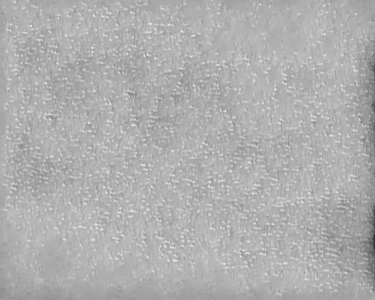 |

This remains the paper's cleanest single result: when events stop arriving, the pipeline stops updating the image, exactly as specified, with no ambiguity about mechanism.

### B. Qualitative Reconstructions

The figure script picks the four longest STATIC bouts of at least 1 s (this bag: \(t\approx 62\)-\(71\), \(72\)-\(85\), \(86\)-\(94\), \(94\)-\(100\) s). On a later bag of similar length with four planned stops, the same four slots fill automatically. Fig. 3 is the eight comparison stills: ungated versus latch at each stop. Fig. 4 adds the freeze-\(h\) row so all three methods sit on one page. Fig. 10 is a high-\(\|\boldsymbol{\omega}\|\) motion window: the three rows should match. Fig. 11 is the HOLD tail: ungated is stretched noise, freeze-\(h\) is a faded canvas, latch is a held photo. HOLD preserves whatever FireNet last output, quality included, and part of the high ORB count on the ungated tail is min-max stretching sensor noise into 8-bit texture that ORB reads as corners. An identical count across 200 windows demonstrates that the count is frozen, not that 1634 stable landmarks exist in the scene.

### C. ARE Gate Versus Ungated, Same Bag

Fig. 2 overlays the freeze-hidden-state ablation (dotted gray) and the released latch (orange) on ungated ORB (blue), with STATIC intervals from (1) shaded on the gyro panel below. Table II splits the ungated and freeze-\(h\) runs by STATIC/MOVING using the nearest IMU sample, over the 16,122 windows with IMU coverage. This table is the ablation, not the released latch.

**Table II.** ORB counts, ungated vs. freeze-hidden-state ARE ablation (\(\delta = 0.08\) rad/s).

| Split | Windows | Ungated mean / median | Gated mean / median |
|-------|---------|------------------------|---------------------|
| STATIC (\(\|\boldsymbol{\omega}\| < \delta\)) | 8332 | 914 / 885 | 292 / 238 |
| MOVING | 7790 | 980 / 1026 | 977 / 1009 |
| All windows | 17,014 | 914 / --- | 608 / --- |
| HOLD tail (2.00 s) | 200 | 1634 (identical) | 223 (identical) |

Two things stand out.

1. **Motion is essentially untouched.** MOVING means differ by roughly 3 (980 vs. 977), which is what a well-behaved gate should look like: it is not incidentally suppressing FireNet whenever the scene happens to be busy, only when the gyro says the platform is not moving.
2. **Rest is where the gate acts.** STATIC mean ORB falls from 914 to 292, a roughly 68% reduction, with the median falling further still (885 to 238). This is direct evidence that the ARE test, applied to FireNet's hidden state, changes reconstruction behavior precisely where the reframing in Section I predicts it should. The HOLD tail remains 200 identical samples in both runs, but the held value itself differs (1634 ungated vs. 223 gated), because this ablation freezes \(h\) while still running inference on sparse voxels rather than latching a pre-fade frame; the released fade-horizon latch (Section IV-C) is a distinct mechanism, applied after this ablation was run, and is not the source of either number in this row.

Read together, Table II shows that `--gate` as ablated here is a gyroscope test that refuses to commit \(h_{\mathrm{out}}\) during STATIC and leaves MOVING windows nearly untouched. It is not, in this configuration, freezing a single sharp reference frame the way the released latch is designed to; empty-window HOLD remains the mechanism that produces bit-identical output when \(n=0\), while the ARE gate here is shown to suppress reconstruction quality selectively rather than to preserve it.

Fig. 13 gives the \(\|\boldsymbol{\omega}\|\) histogram against the same threshold.

**Table III.** Session summary.

| Quantity | Value |
|----------|--------|
| Events | \(1.107\times 10^{9}\) |
| Event duration | 168.15 s |
| Reconstruction windows | 17,014 \(\times\) 10 ms (incl. 2.00 s tail) |
| FireNet time (mid-run) | about 7 ms/window |
| Peak VRAM | 1328 / 6140 MiB |
| IMU rate (aligned) | 24.0 Hz, 3819 samples |
| IMU-event start gap | 8.91 s |
| \(\delta\) | 0.08 rad/s (49% of samples below) |
| IMU gate off | `session_1136` |
| Freeze-\(h\) ablation | `session_1136_gated` |
| Fade-horizon latch + extensions | `session_1136_enhanced` |

### D. Fade-Horizon Latch, Same Bag

The released default was then run on the same HDF5 file (`out/session_1136_enhanced`). Fig. 2 (orange) and Figs. 5-9 are that run. After a brief MOVING spike the latch locks at 397 ORB through the longest STATIC bout (\(t \approx 72\)-\(85\) s); ungated ORB keeps wandering. Three plateaus of at least 0.5 s appear: \(t \in [51.19, 71.93]\) (ORB 110), \(t \in [72.97, 102.70]\) (ORB 397), and \(t \in [148.41, 170.13]\) (ORB 62, including the empty-window tail). Short STATIC bouts under 1 s do not latch. That is the min-static rule, not a failure of ARE.

On the same nearest-IMU split, latch MOVING mean ORB is 959 against ungated 980, close enough that the gate is still not randomly suppressing motion. Latch STATIC mean/median is 284/118. The median is pulled down by the 110 and 62 plateaus. Those numbers are not a claim that the latch is worse than freeze-\(h\) (292/238). Freeze-\(h\) is a fading canvas that still produces ORB-looking corners on sparse voxels. The latch is a held photo. Figs. 3-4 and 10-12 are the evidence that matters for a preview or a detector. The HOLD tail under the latch is 62 identical counts, not 1634: the ungated tail is stretched noise.

### E. Temporal Stability Placeholders

Table IV and Figs. 14-16 are produced by `scripts/stability_metrics.py`. Fill after the ~240 s four-stop bag (a pilot pass on this bag is allowed if the videos exist; still label it as this bag, not as the planned-stop result). Reference is always \(\hat{I}_{\ell}\), never \(t_{\mathrm{stop}}\).

**Table IV.** STATIC stability vs. latched snapshot \(\hat{I}_{\ell}\) on this bag (four longest gyro-quiet bouts, not planned stops). Mean over those four. Latch SSIM near 1 is the freeze check: the reference *is* the latched canvas. Replace after the 240 s four-stop bag.

| Metric | Ungated | Freeze-\(h\) | Latch |
|--------|---------|--------------|-------|
| SSIM vs. \(\hat{I}_{\ell}\) | 0.22 | 0.78 | 1.00 |
| Farneback \(\|\mathbf{v}\|\) (px) | 1.14 | 0.23 | 0.015 |
| KLT survival (\%) | 40 | 74 | 100 |

---

## VIII. Discussion

### A. What "Sufficient" Means Here

Skog *et al.* [6] answer a specific question: can inertial measurement, cheaply and without external reference, detect foot stance well enough to support ZUPT correction? Their answer is yes, for ARE and SHOE, with gyroscope energy carrying most of the discriminative information [6], [7]. Transferring that answer to a camera is valid only if the task asked of the sensor is matched precisely, and this paper has tried to keep that match exact throughout. If the task is deciding whether a reconstruction should stop updating, ARE is the right detector family and a MEMS IMU is sufficient, in the same sense Skog's gyroscope was sufficient for stance detection: no absolute velocity reference is needed for a binary decision of this kind, and Table II shows the decision changing reconstruction behavior exactly where it should while leaving motion alone.

If the task is recovering the camera's linear velocity, a MEMS IMU is not sufficient, and nothing in this paper claims otherwise. Integration drifts within seconds [8]. A gyroscope cannot, by construction, see translation that produces no rotation. Skog's shoe is mechanically forced into ground contact at regular intervals; a Triton2 on a slider, drone, or vehicle has no such constraint, which is exactly why Section IV-B lists false STATIC as an expected rather than incidental failure mode. A fixed \(\delta\) also needs retuning if the IMU or the underlying motion mix changes [8]; 0.08 rad/s here sits near this particular bag's median \(\|\boldsymbol{\omega}\|\) and is not proposed as a universal value.

### B. Two Mechanisms, Correctly Scoped

Three configurations appear in this paper and should not be conflated. Empty-window HOLD (Section VII-A) is measured directly and is unambiguous: it fires only on true event silence and reuses the last frame bit-for-bit. The freeze-hidden-state ablation of the ARE gate (Section VII-C) is also measured directly, and shows the gate selectively suppressing STATIC-window ORB counts while leaving MOVING windows nearly untouched, but it does so by discarding a hidden-state update while still running inference on sparse input, so the emitted canvas keeps fading rather than being preserved. The fade-horizon latch (Section IV-C) is the released default that addresses exactly that gap, skipping inference after 1 s of confirmed STATIC and re-emitting a pre-fade frame from a rolling buffer. It is now run on the same bag (Section VII-D). Read correctly: HOLD is a complete, measured fix for the case where events actually stop; the ablation demonstrates that ARE-gated state suppression measurably changes reconstruction exactly where it should; and the latch is what closes the remaining gap between "the gate suppresses \(h\)" and "the gate holds a good image."

### C. Stereo and Reconstruction Quality

A shared \(D_k\) is the entire stereo contribution here: both reconstructions freeze on the same decision, which disparity stability requires. Without a second synchronized camera recording this is not yet measured; the CLI (`--events-left`, `--events-right`, one shared IMU) exists so the remaining work is a capture problem, not an algorithmic one. Separately, FireNet's softness on dense 10 ms windows (often \(10^{4}\)-\(10^{5}\) events) matches what [5] reports under fast motion and is compounded by naive per-window min-max tone mapping (Section VII-B); improving E2V reconstruction quality itself is orthogonal to everything argued here about when to hold a state.

### D. Next Steps

Three extensions follow directly from where the evidence currently stops.

1. **Address gyro-blind translation.** False STATIC (Section IV-B) is a structural limit of gyroscope-only ARE on an unconstrained mount, not a bug to patch locally. Consistent with this paper's own reasoning about why accelerometer magnitude is a weak cue on a rigid mount (Section IV-B), the direct fix is Skog's own SHOE detector [6], which fuses ARE with acceleration *variance* rather than magnitude, giving sensitivity to jitter during otherwise rotationally quiet translation. A detector that instead adds \(\|\mathbf{a}-g\hat{\mathbf{n}}\|\) does not fix a constant-velocity slider: that term is small whenever \(\|\boldsymbol{\omega}\|\) is small and specific force is near \(g\). SHOE needs a faster IMU than the 24 Hz sidecar used here.
2. **Measure hold as temporal stability, not only ORB count.** ORB on min-max stretched FireNet is a freeze detector, not a tracker and not image quality (Section VII-B). Section IV-E and Table IV are the protocol: SSIM of STATIC frames against the *latched* snapshot \(\hat{I}_{\ell}\), not against the starved window where \(\|\boldsymbol{\omega}\|\) first crosses \(\delta\); Farneback flow magnitude during STATIC (latch should sit near 0; ungated should not); and KLT track survival from stop onset over intervals longer than 10 s. NIQE/BRISQUE on 8-bit stretched reconstructions are not photometric and are not claimed here. Table II stays the freeze-\(h\) ablation. Table IV is a pilot on this bag (script ran); recompute on the planned-stop recording.
3. **Validate the stereo gate.** With the single-camera mechanism measured, capturing a synchronized Triton2 pair and confirming both reconstructions freeze on an identical \(D_k\), and more importantly that disparity computed on the held pair stays stable rather than merely present, connects this work to ESVO [2] and ESVIO [11] without requiring that either full system be built here.

None of these require revisiting the reframing in Section I; they are the experiments that reframing predicts should be run next, in the order its own stated limitations demand.

---

## IX. Conclusion

A pure EVS camera has no grayscale image to fall back on when the world stops changing, and recurrent E2V networks forget the scene unless something holds their state. On a 168 s, \(1.11\times 10^{9}\)-event Triton2 recording, we measured two mechanisms for that hold. Empty-window HOLD reuses the last FireNet frame bit-for-bit for 2.00 s after the last event, with ORB count frozen at 1634. An ARE-style MEMS gyro gate at \(\delta = 0.08\) rad/s, following Skog *et al.* [6], measurably suppresses ORB counts in STATIC windows (914 to 292 mean) while leaving MOVING windows essentially unchanged (980 to 977 mean), demonstrating that gyroscope-only zero-velocity detection changes FireNet's reconstruction behavior exactly where the reframing in Section I predicts it should. A released fade-horizon latch addresses the remaining gap between suppressing the hidden state and preserving image quality, and on this bag it locks long STATIC bouts to identical canvases (Section VII-D). The IMU is sufficient for this detection task; it is not a substitute for visual odometry, and gyroscope-only ZVD has a known blind spot to translation without rotation that a future SHOE-based extension can address directly. A shared gate for stereo EVS is specified so both cameras inherit the same standstill decision.

---

## Acknowledgments

This work was carried out in the Intelligent Navigation and Mapping Laboratory (INML), Schulich School of Engineering, University of Calgary, under the supervision of Dr. Hongzhou Yang.

---

## Software Availability

The CUDA/TensorRT pipeline (HDF5 event ingestion, IMU ARE gate, empty-window HOLD, fade-horizon latch, stereo CLI) is released as libeventgate [15]. FireNet weights are not redistributed and are obtained from the authors of [5]. The session used in this paper is approximately 6 GB of raw events and is not included in the repository.

---

## References

[1] G. Gallego *et al.*, "Event-based vision: A survey," *IEEE Trans. Pattern Anal. Mach. Intell.*, vol. 44, no. 1, pp. 154-180, Jan. 2022.

[2] Y. Zhou, G. Gallego, and S. Shen, "Event-based stereo visual odometry," *IEEE Robot. Autom. Lett.*, vol. 6, no. 2, pp. 621-628, Apr. 2021.

[3] D. Gehrig, M. Gehrig, J. Hidalgo-Carrio, and D. Scaramuzza, "Video to events: Recycling video datasets for event cameras," in *Proc. IEEE/CVF Conf. Comput. Vis. Pattern Recognit. (CVPR)*, 2020.

[4] H. Rebecq, R. Ranftl, V. Koltun, and D. Scaramuzza, "High speed and high dynamic range video with an event camera," *IEEE Trans. Pattern Anal. Mach. Intell.*, vol. 43, no. 6, pp. 1964-1980, Jun. 2021.

[5] C. Scheerlinck, H. Rebecq, D. Gehrig, N. Barnes, R. Mahony, and D. Scaramuzza, "Fast image reconstruction with an event camera," in *Proc. IEEE Winter Conf. Appl. Comput. Vis. (WACV)*, 2020, pp. 156-163.

[6] I. Skog, P. Handel, J.-O. Nilsson, and J. Rantakokko, "Zero-velocity detection: An algorithm evaluation," *IEEE Trans. Biomed. Eng.*, vol. 57, no. 11, pp. 2657-2666, Nov. 2010.

[7] I. Skog, J.-O. Nilsson, and P. Handel, "Evaluation of zero-velocity detectors for foot-mounted inertial navigation systems," in *Proc. Int. Conf. Indoor Positioning Indoor Navigat. (IPIN)*, 2010.

[8] J. Wahlstrom and I. Skog, "Fifteen years of progress at zero velocity: A review," *IEEE Sensors J.*, vol. 21, no. 2, pp. 1139-1151, Jan. 2021.

[9] H. Rebecq, T. Horstschafer, G. Gallego, and D. Scaramuzza, "EVO: A geometric approach to event-based 6-DOF parallel tracking and mapping in real time," *IEEE Robot. Autom. Lett.*, vol. 2, no. 2, pp. 593-600, Apr. 2017.

[10] A. R. Vidal, H. Rebecq, T. Horstschaefer, and D. Scaramuzza, "Ultimate SLAM? Combining events, images, and IMU for robust visual SLAM in HDR and high-speed scenarios," *IEEE Robot. Autom. Lett.*, vol. 3, no. 2, pp. 994-1001, Apr. 2018.

[11] P. Chen, W. Guan, and P. Lu, "ESVIO: Event-based stereo visual-inertial odometry," *Sensors*, vol. 23, no. 4, 2023.

[12] E. Foxlin, "Pedestrian tracking with shoe-mounted inertial sensors," *IEEE Comput. Graph. Appl.*, vol. 25, no. 6, pp. 38-46, Nov./Dec. 2005.

[13] J.-O. Nilsson, I. Skog, and P. Handel, "A note on the limitations of ZUPTs and the implications on sensor error modeling," in *Proc. Int. Conf. Indoor Positioning Indoor Navigat. (IPIN)*, 2012.

[14] Lucid Vision Labs, "Triton2 EVS (TRT003S-EC)," product documentation. [Online]. Available: https://thinklucid.com/product/triton2-evs-0-3mp-imx637/

[15] V. Bansal, "libeventgate," GitHub repository, 2026. [Online]. Available: https://github.com/VyapakBansal/libeventgate

---

## Figure captions

All of these files are written by `scripts/plot_imu_hold_paper.py` (`--n-stops 4`). After a new ~240 s bag with four stops, re-run the script. Filenames do not change.

**Fig. 1.** Pipeline.


**Fig. 2.** Session overlay. Blue: ungated. Gray dotted: freeze-\(h\). Orange: latch. Bottom: \(\|\boldsymbol{\omega}\|\) and STATIC.


**Fig. 3.** Eight comparison stills at the four longest STATIC bouts: ungated (top) versus latch (bottom).

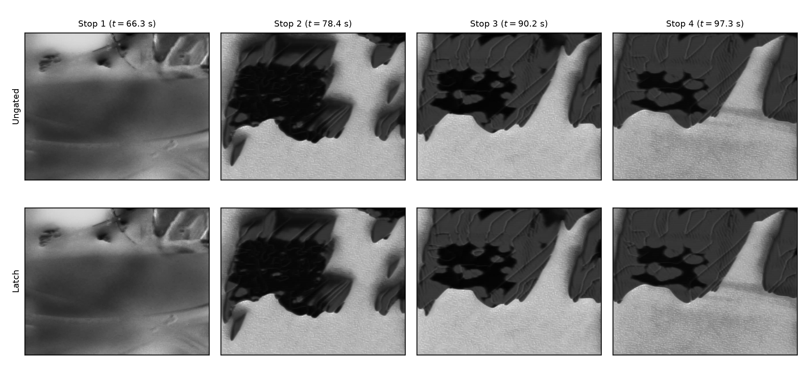

Stop-by-stop stills (ungated | freeze-\(h\) | latch). These twelve files plus the six motion/HOLD stills below are twenty images.

| Stop | Ungated | Freeze-\(h\) | Latch |
|------|---------|--------------|-------|
| 1 | 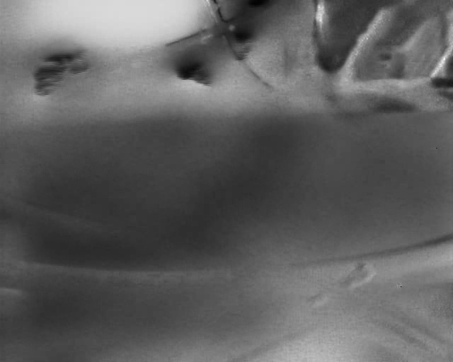 | 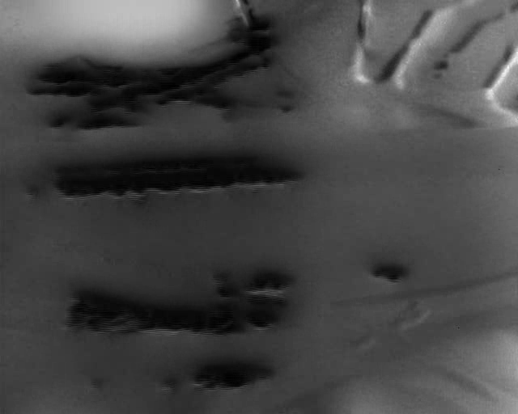 |  |
| 2 | 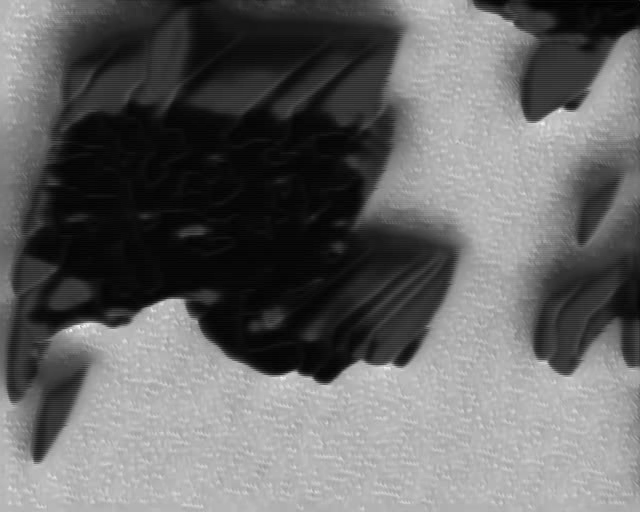 | 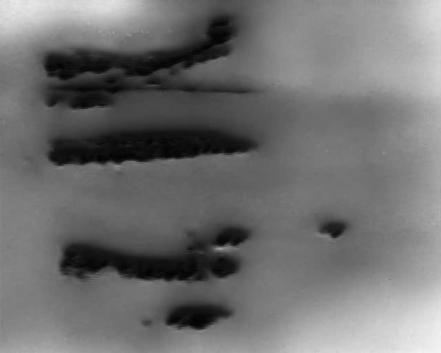 |  |
| 3 | 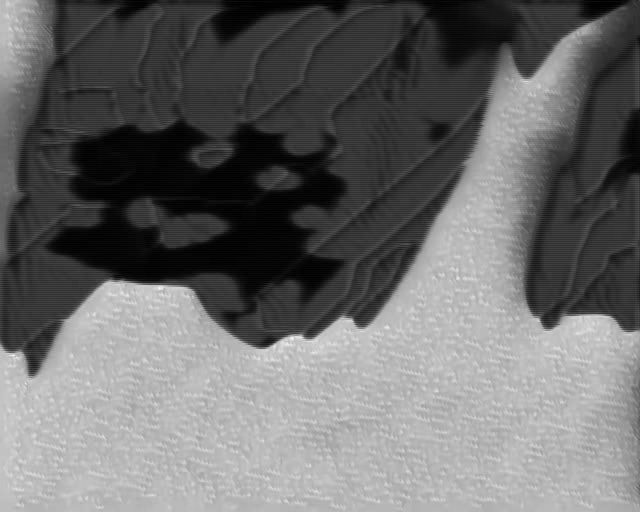 | 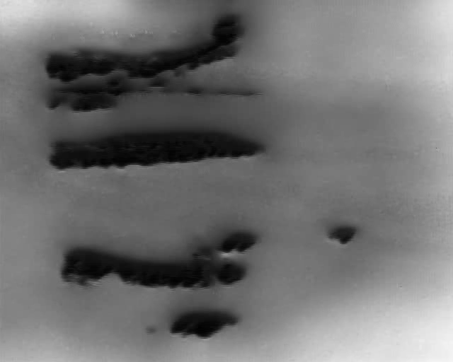 |  |
| 4 |  | 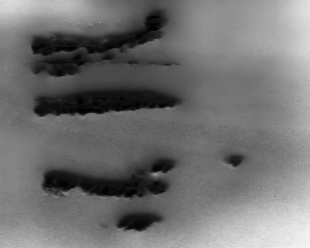 | 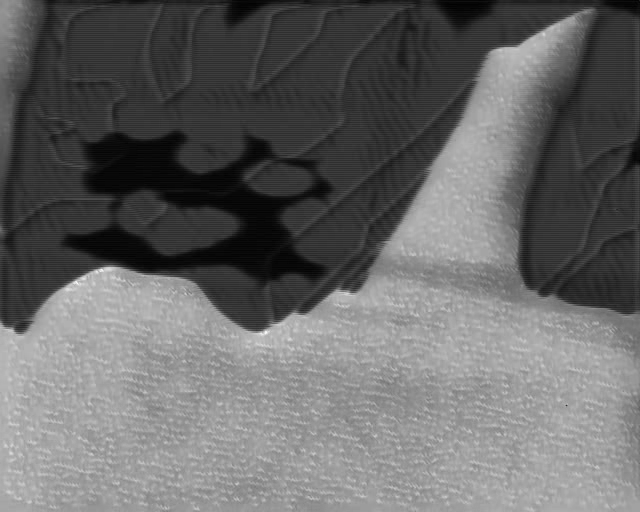 |

**Fig. 4.** Same four stops with freeze-\(h\) as the middle row.

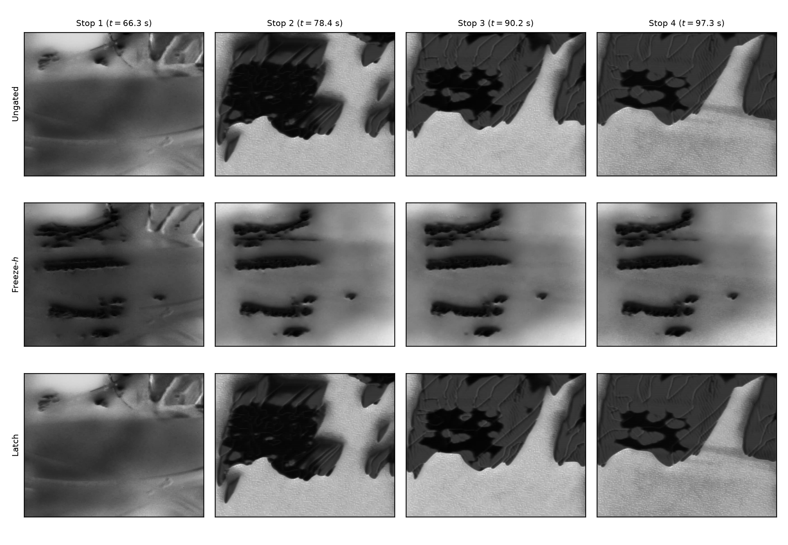

**Fig. 5.** Four-stop ORB / gyro zooms on one page.

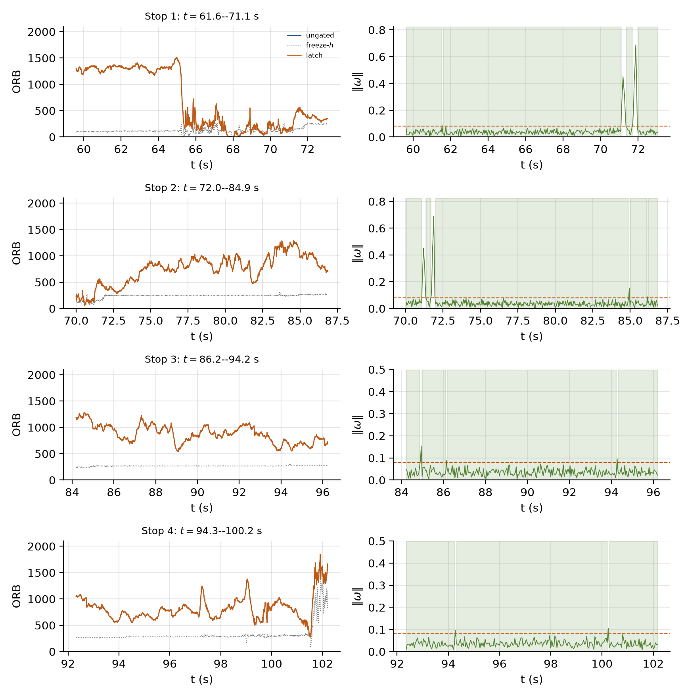

**Fig. 6.** Motion window, three methods.

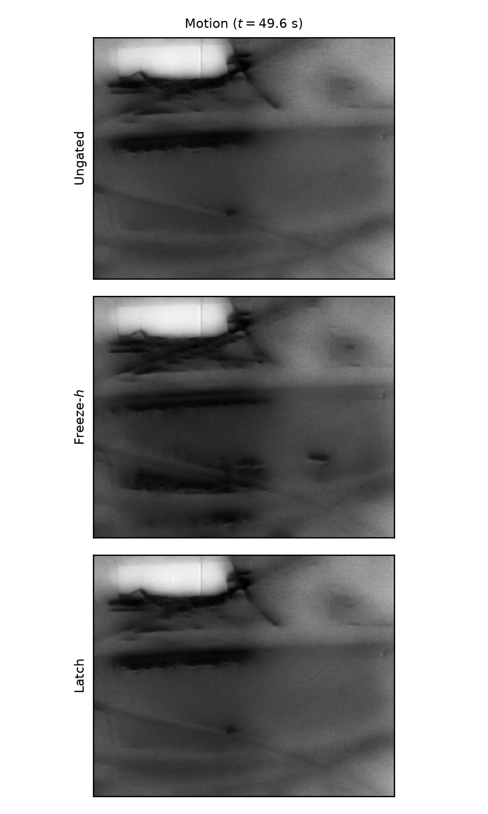

| Ungated | Freeze-\(h\) | Latch |
|---------|--------------|-------|
|  | 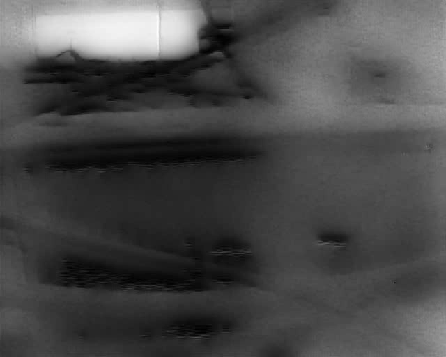 | 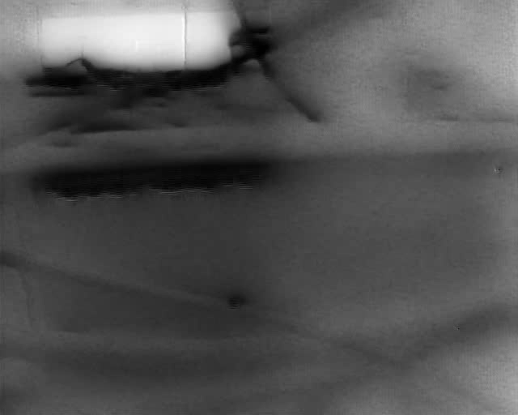 |

**Fig. 7.** HOLD tail, three methods.

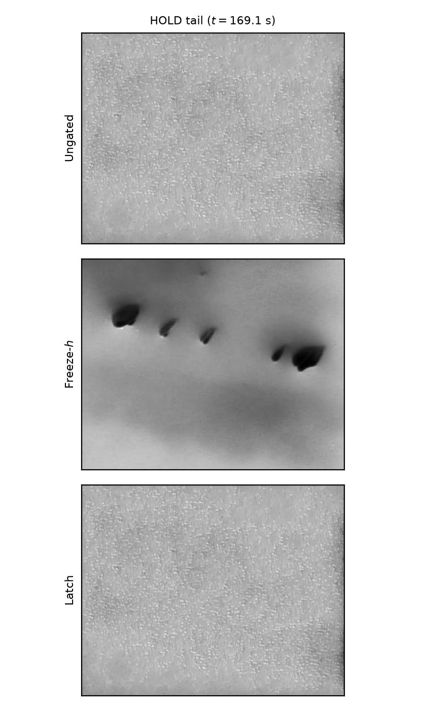

| Ungated | Freeze-\(h\) | Latch |
|---------|--------------|-------|
|  | 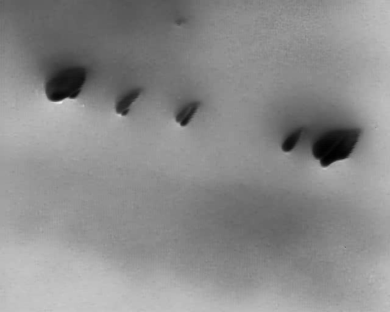 |  |

**Fig. 8.** Histogram of \(\|\boldsymbol{\omega}\|\) and \(\delta\).


**Fig. 9.** SSIM vs. latched canvas \(\hat{I}_{\ell}\) (pilot on this bag).

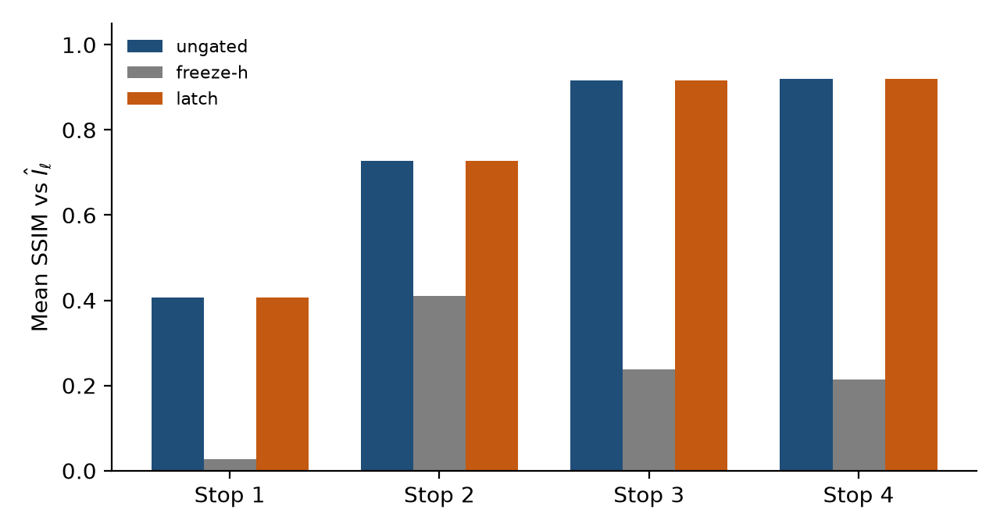

**Fig. 10.** Farneback mean flow during STATIC (pilot).

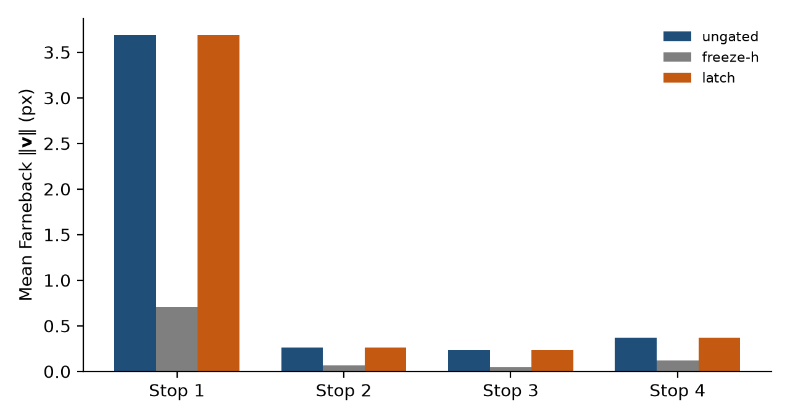

**Fig. 11.** KLT survival at stop end (pilot).

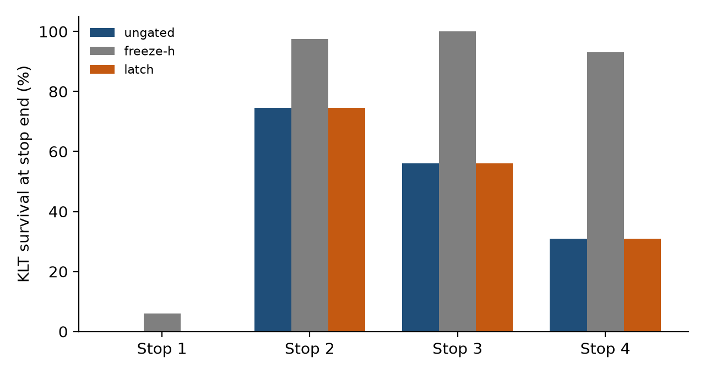

For RA-L, keep Figs. 1–5, Table II, Table IV, and Fig. 9. Per-stop zoom PNGs are still generated but not cited here.

---

## Appendix: Reproducibility commands

Figures are produced only by the Python scripts. After a new recording of similar length, replace `eventgate_usb/` (events, IMU, MANIFEST), re-run the three `eventgate` commands, then re-run the plot script. Filenames stay the same; times and stills are taken from the CSVs. Do not edit the PNGs by hand.

```bash
python3 -m venv .venv && .venv/bin/pip install -r requirements.txt

.venv/bin/python3 scripts/plot_imu_hold_paper.py \
  --manifest eventgate_usb/MANIFEST.json \
  --imu eventgate_usb/imu.csv \
  --keypoints out/session_1136/keypoints.csv \
  --keypoints-gated out/session_1136_gated/keypoints.csv \
  --keypoints-lookback out/session_1136_enhanced/keypoints.csv \
  --video-ungated out/session_1136/recon.mp4 \
  --video-gated out/session_1136_gated/recon.mp4 \
  --video-lookback out/session_1136_enhanced/recon.mp4 \
  --out figures/imu_gated_evs_hold \
  --thresh 0.08 --n-stops 4 --min-stop-s 1
.venv/bin/python3 scripts/draw_pipeline_fig.py
.venv/bin/python3 scripts/stability_metrics.py \
  --video-ungated out/session_1136/recon.mp4 \
  --video-gated out/session_1136_gated/recon.mp4 \
  --video-lookback out/session_1136_enhanced/recon.mp4 \
  --out figures/imu_gated_evs_hold
# Then copy fig_ssim_stops / fig_flow_stops / fig_klt_stops / stability_metrics.json
# into paper/figures/ and fill Table IV. Reference is always I_ell, never t_stop.
```

Ungated reconstruction (Section VII-A, VII-B):

```bash
./build/eventgate --events eventgate_usb/events.h5 \
  --imu eventgate_usb/imu.csv --engine engines/firenet.engine \
  --out out/session_1136 --blackout-tail-s 2 --vram-every 50
```

Freeze-\(h\) ablation (Section VII-C, Table II; `out/session_1136_gated`). That run used `--gate` when `--gate` still meant freeze-\(h\). On current code, `--gate` is the latch. Reproducing Table II on a new bag requires `--ablate-freeze-h`:

```bash
export LD_LIBRARY_PATH="${HOME}/sdks/TensorRT-10.16.1.11/lib:${LD_LIBRARY_PATH:-}"
./build/eventgate --events eventgate_usb/events.h5 \
  --imu eventgate_usb/imu.csv --engine engines/firenet.engine \
  --ablate-freeze-h --gyro-thresh 0.08 --out out/session_1136_gated \
  --blackout-tail-s 2 --vram-every 50
```

Fade-horizon latch (library default [15]; Section VII-D):

```bash
./build/eventgate --events eventgate_usb/events.h5 \
  --imu eventgate_usb/imu.csv --engine engines/firenet.engine \
  --gate --gyro-thresh 0.08 --hold-lookback-s 1 --hold-min-static-s 1 --hold-release-s 0.25 \
  --out out/session_1136_enhanced --blackout-tail-s 2 --vram-every 50
```
